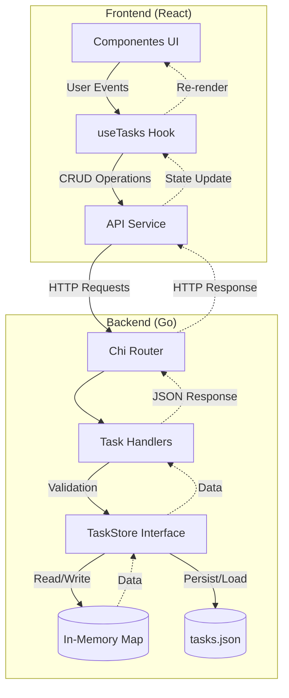

# Diagramas - Como Gerar

Os diagramas estão em formato Mermaid (.mmd) e podem ser convertidos para PNG usando:

## Opção 1: Mermaid CLI
```bash
npm install -g @mermaid-js/mermaid-cli
mmdc -i docs/user-flow.mmd -o docs/user-flow.png
mmdc -i docs/data-flow.mmd -o docs/data-flow.png
```

## Opção 2: VS Code + Mermaid Preview
- Instale a extensão "Mermaid Preview" no VS Code
- Abra o arquivo .mmd
- Clique com botão direito > "Export as PNG"

## Opção 3: Online
- Cole o conteúdo em https://mermaid.live
- Exporte como PNG

---

## User Flow (user-flow.mmd)

```mermaid
graph TD
    A[Início] --> B{Carrega Tarefas}
    B -->|Erro| C[Exibe Erro]
    B -->|Sucesso| D[Exibe Kanban]
    
    D --> E[Ações do Usuário]
    
    E --> F[Criar Tarefa]
    E --> G[Editar Tarefa]
    E --> H[Mover Coluna]
    E --> I[Excluir Tarefa]
    
    F --> F1[Abre Modal]
    F1 --> F2[Preenche Formulário]
    F2 --> F3[POST /tasks]
    F3 --> F4[Atualiza Estado]
    F4 --> D
    
    G --> G1[Abre Modal com Dados]
    G1 --> G2[Edita Campos]
    G2 --> G3[PUT /tasks/:id]
    G3 --> G4[Atualiza Estado]
    G4 --> D
    
    H --> H1[Clica Botão Mover]
    H1 --> H2[PUT /tasks/:id {status}]
    H2 --> H3[Atualiza Estado]
    H3 --> D
    
    I --> I1[Confirma Exclusão]
    I1 --> I2[DELETE /tasks/:id]
    I2 --> I3[Atualiza Estado]
    I3 --> D
    
    C --> J[Tentar Novamente]
    J --> B
```

## Data Flow (data-flow.mmd)

